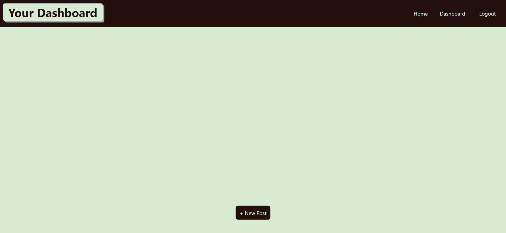

# blog-site

## Description

CMS-style blog site similar to a Wordpress site, where developers can publish thier blog posts and comment on other developers' posts as well. Follows the MVC paradigm in ths architechtural structure, using Handlebars.js as the templating language, Sequelize as the ORM, and the express-session npm package for authentication.

# Screenshots

# Link to Deployed Application

